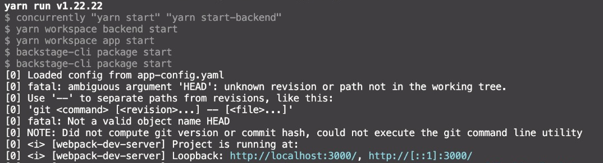

# Luiz Backstage App

Para documentar o processo de compilação e execução da ferramenta Backstage em um arquivo markdown, vamos seguir as instruções fornecidas e adicionar evidências visuais por meio de capturas de tela.

# Processo de Compilação e Execução do Backstage

## Compilação do Backstage

1. **Instalação do Backstage:**
   - Execute o comando abaixo para instalar o Backstage:
     ```
     npx @backstage/create-app@latest --skip-install
     ```
   - Defina um nome para a aplicação quando solicitado.
   - Navegue até a pasta da aplicação e execute:
     ```
     yarn install
     ```
   - Se necessário, atualize o Yarn com:
     ```
     npm install --global yarn
     ```

2. **Preparação do Build do Backstage:**
   - Execute os seguintes comandos:
     ```
     yarn install --frozen-lockfile
     yarn tsc
     yarn build:backend
     ```

3. **Ajuste do Dockerfile do Backstage:**
   - Abra o projeto no VSCode.
   - Acesse o Dockerfile do backend em `packages > backend > Dockerfile`.
   - Substitua o conteúdo pelo Dockerfile fornecido.

4. **Compilação do Docker Image:**
   - Execute o seguinte comando para construir a imagem Docker:
     ```
     docker image build . -f packages/backend/Dockerfile --tag backstage --no-cache
     ```

## Execução do Backstage

1. **Execução do Container Docker:**
   - Após a compilação da imagem Docker, execute o seguinte comando para iniciar o container:
     ```
     docker run -it -p 7007:7007 backstage
     ```

2. **Acesso ao Backstage:**
   - Após a conclusão, abra o navegador e acesse o Backstage em [http://localhost:7007](http://localhost:7007).

# Evidências

## Como criar localmente o app backstage:

1 - Comando para criar o app:


2 - Instale as dependências:


3 - Inicie o app:


