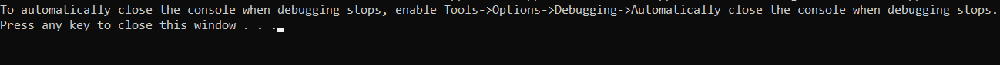
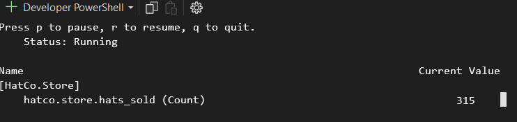

# Relatório: Implementação do Tutorial "Criando Métricas"

Neste relatório, documentarei a implementação do tutorial "Criando Métricas", onde aprendi a utilizar a API de Métricas do .NET para instrumentar meu código e coletar métricas para monitoramento e análise de desempenho.

## Aprendizados Adquiridos

- Aprendi a importância da instrumentação de código para monitorar e entender o comportamento de um sistema em tempo real.
- Entendi como utilizar a API de Métricas do .NET para criar e registrar diferentes tipos de métricas, como contadores, medidores e histogramas.
- Compreendi a importância de definir descrições e unidades adequadas para as métricas, para facilitar a interpretação dos dados.
- Aprendi a associar métricas a marcas (tags), permitindo categorizar os dados para análise detalhada.
- Entendi como evitar armadilhas comuns, como a alocação excessiva de memória ao lidar com um grande número de combinações de marcas.

## Passo a Passo Seguido

1. **Configuração do Ambiente**: Configurei meu ambiente de desenvolvimento com o SDK do .NET e o Visual Studio Code.
2. **Criação do Projeto**: Criei um novo projeto .NET usando o comando `dotnet new console`.
3. **Adição da Referência**: Adicionei a referência necessária para utilizar a API de Métricas do .NET ao meu projeto.
4. **Criação de Métricas**: Criei métricas para monitorar o desempenho do meu sistema, como contadores e medidores.
5. **Registro de Métricas**: Registrei as métricas no meu código, utilizando métodos como `Add` e `Record`.
6. **Definição de Descrições e Unidades**: Defini descrições e unidades adequadas para as métricas, para facilitar a interpretação dos dados.
7. **Associação de Marcas (Tags)**: Associei métricas a marcas (tags) para categorizar os dados e permitir análises detalhadas.
8. **Execução e Monitoramento**: Executei o programa e utilizei ferramentas como o `dotnet-counters` para monitorar e visualizar as métricas em tempo real.
9. **Documentação e Relatório**: Documentei o processo de implementação e aprendizados adquiridos em um relatório utilizando Markdown.

## Código program.cs

```csharp
using ConsoleApp_metrics;
using Microsoft.AspNetCore.Builder;
using Microsoft.Extensions.DependencyInjection;
using Microsoft.Extensions.Hosting;
using System.Diagnostics.Metrics;
using System.Threading;

var builder = WebApplication.CreateBuilder(args);
builder.Services.AddSingleton<HatCoMetrics>();

var app = builder.Build();

app.MapGet("/", (HatCoMetrics hatCoMetrics) =>
{
    hatCoMetrics.SimulateMetrics();
    return "Metrics Updated";
});

app.Run();

public partial class Program
{
    static Meter s_meter = new Meter("HatCo.Store");
    static Counter<int> s_hatsSold = s_meter.CreateCounter<int>("hatco.store.hats_sold");

    public static void Main(string[] args)
    {
        Console.WriteLine("Project running. Press any key to stop.");
        while (!Console.KeyAvailable)
        {
            Thread.Sleep(1000);
            s_hatsSold.Add(4);
        }
    }
}

```

## Prints de Execução





## Considerações Finais

A implementação do tutorial "Criando Métricas" foi uma boa experiência. Aprendi não apenas a utilizar a API de Métricas do .NET, mas também a importância da instrumentação de código para monitoramento e análise de desempenho. Acho que os conhecimentos adquiridos serão úteis para melhorar a qualidade do projeto do módulo.