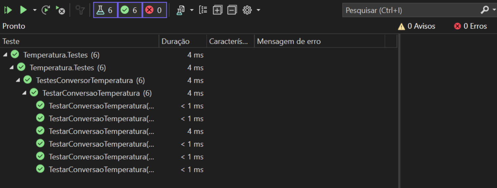

# Aplicando Testes

Este repositório demonstra a implementação de testes unitários utilizando os frameworks xUnit, NUnit e MSTest em uma aplicação .NET que converte temperaturas de Fahrenheit para Celsius.

## Índice

- [Testes de Unidade com xUnit](#testes-de-unidade-com-xunit)
- [Testes de Unidade com NUnit](#testes-de-unidade-com-nunit)
- [Testes de Unidade com MSTest](#testes-de-unidade-com-mstest)

---

## Testes de Unidade com xUnit

### Descrição

xUnit é um framework de teste popular para .NET. Ele permite a criação de testes parametrizados utilizando os atributos `Theory` e `InlineData`.

### Exemplos de Testes

```csharp
using System;
using Xunit;

namespace Temperatura.Testes
{
    public class TestesConversorTemperatura
    {
        [Theory]
        [InlineData(32, 0)]
        [InlineData(47, 8.33)]
        [InlineData(86, 30)]
        [InlineData(90.5, 32.5)]
        [InlineData(120.18, 48.99)]
        [InlineData(212, 100)]
        public void TestarConversaoTemperatura(
            double fahrenheit, double celsius)
        {
            double valorCalculado =
                ConversorTemperatura.FahrenheitParaCelsius(fahrenheit);
            Assert.Equal(celsius, valorCalculado);
        }
    }
}
```

## Testes de Unidade com NUnit

### Descrição

NUnit é outro framework de teste para .NET, conhecido pela sua flexibilidade e facilidade de uso. Ele utiliza o atributo `TestCase` para testes parametrizados.

### Exemplos de Testes

```csharp
using NUnit.Framework;

namespace Temperatura.Testes
{
    public class TestesConversorTemperatura
    {
        [TestCase(32, 0)]
        [TestCase(47, 8.33)]
        [TestCase(86, 30)]
        [TestCase(90.5, 32.5)]
        [TestCase(120.18, 48.99)]
        [TestCase(212, 100)]
        public void TesteConversaoTemperatura(
            double tempFahrenheit, double tempCelsius)
        {
            double valorCalculado =
                ConversorTemperatura.FahrenheitParaCelsius(tempFahrenheit);
            Assert.AreEqual(tempCelsius, valorCalculado);
        }
    }
}
```

## Testes de Unidade com MSTest

### Descrição

MSTest é o framework de teste da Microsoft, integrado ao Visual Studio. Ele utiliza os atributos `DataTestMethod` e `DataRow` para criar testes parametrizados.

### Exemplos de Testes

```csharp
using Microsoft.VisualStudio.TestTools.UnitTesting;

namespace Temperatura.Testes
{
    [TestClass]
    public class TestesConversorTemperatura
    {
        [DataRow(32, 0)]
        [DataRow(47, 8.33)]
        [DataRow(86, 30)]
        [DataRow(90.5, 32.5)]
        [DataRow(120.18, 48.99)]
        [DataRow(212, 100)]
        [DataTestMethod]
        public void TesteConversaoTemperatura(
            double tempFahrenheit, double tempCelsius)
        {
            double valorCalculado =
                ConversorTemperatura.FahrenheitParaCelsius(tempFahrenheit);
            Assert.AreEqual(tempCelsius, valorCalculado);
        }
    }
}
```

## Print dos Testes Executados


