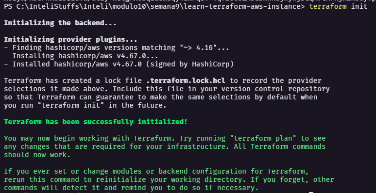
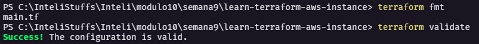
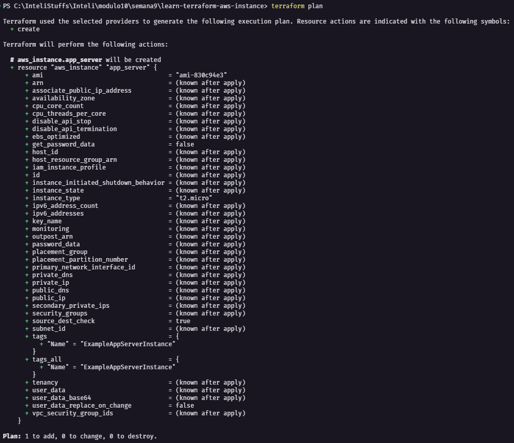
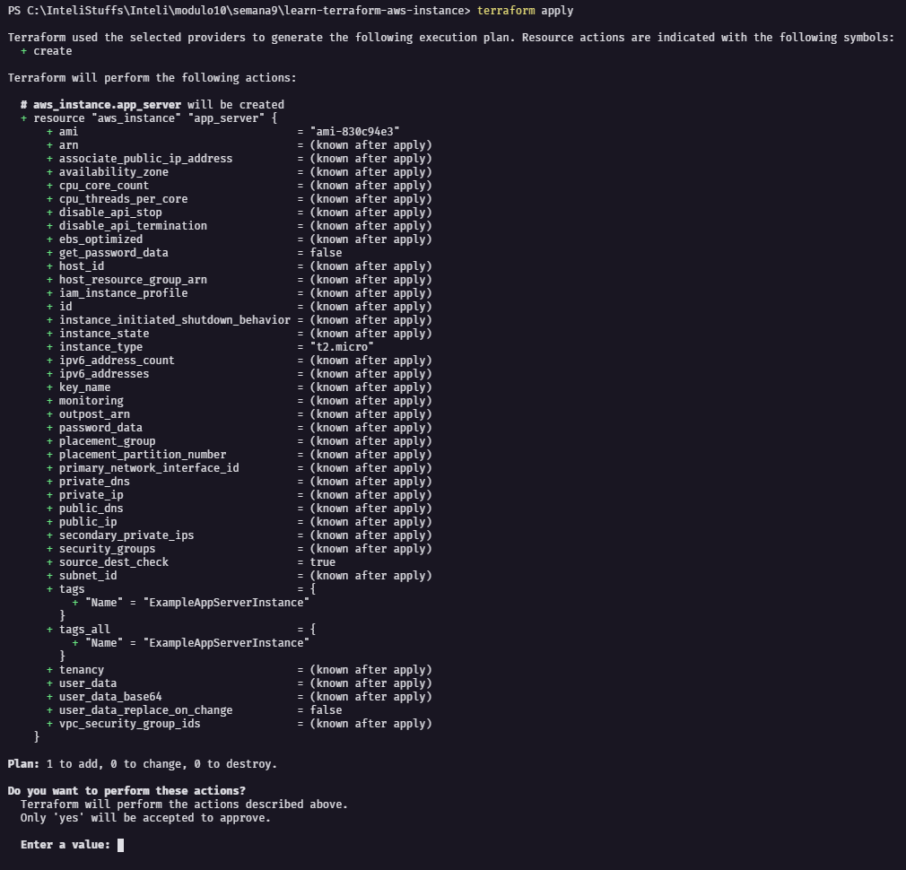
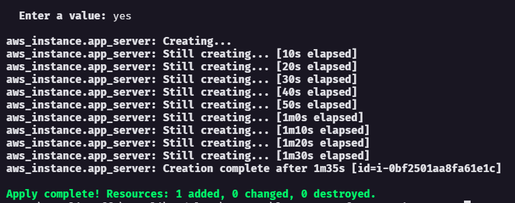
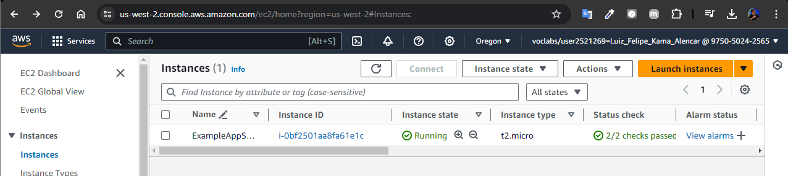
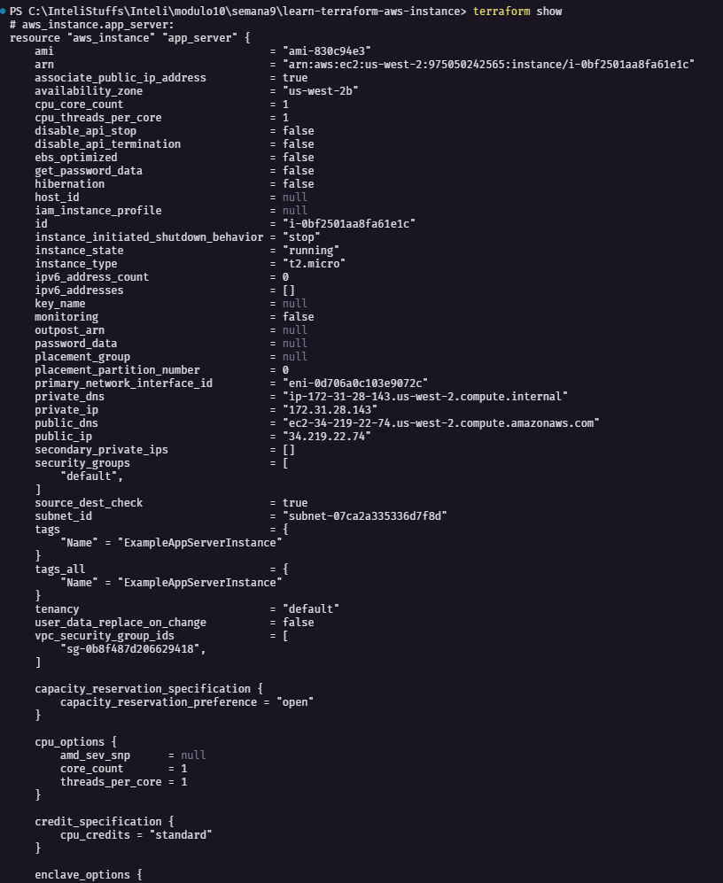

# Passo 1: Configuração do Ambiente

## Instalar a CLI do Terraform


Antes de começar, é necessário instalar o Terraform. Siga as instruções no site oficial para o seu sistema operacional.

[Instalar o Terraform](https://developer.hashicorp.com/terraform/install)

## Instalar AWS CLI

Certifique-se de ter a AWS CLI instalada e configurada com suas credenciais.

[Instalar AWS CLI](https://docs.aws.amazon.com/cli/latest/userguide/getting-started-install.html)

### Configurar AWS CLI

Rode o se o seguinte comando:

```
aws configure
```
Caso esteja usando a AWS academy como eu, ainda será necessário passar o SESSION_TOKEN:

```
aws configure set aws_session_token [TOKEN]
```

# Passo 2: Criar o Código Terraform

1. Criar um Diretório para o Projeto

    Crie um diretório para o seu projeto e navegue até ele:

2. Criar o Arquivo de Configuração Principal
Crie um arquivo chamado main.tf e adicione o seguinte código:

```
terraform {
  required_providers {
    aws = {
      source  = "hashicorp/aws"
      version = "~> 4.16"
    }
  }

  required_version = ">= 1.2.0"
}

provider "aws" {
  region = "us-west-2"
}

resource "aws_instance" "app_server" {
  ami           = "ami-830c94e3"
  instance_type = "t2.micro"

  tags = {
    Name = "ExampleAppServerInstance"
  }
}
```

Esse código define um provedor AWS e uma instância EC2.

# Passo 3: Executar o Código Terraform

Após configurar as variáveis e o arquivo de configuração, execute os comandos a seguir para preparar e aplicar a infraestrutura com o Terraform:

- **Inicializar o diretório de trabalho do Terraform:**
    ```sh
    terraform init
    ```
    Este comando configura o ambiente para começar a utilizar o Terraform, baixando os plugins necessários.

- **Formatar o código Terraform:**
    ```sh
    terraform fmt
    ```
    Este comando ajusta o código para seguir as convenções de estilo recomendadas pelo Terraform, facilitando a leitura e manutenção.

- **Validar a sintaxe e semântica do código Terraform:**
    ```sh
    terraform validate
    ```
    Valide seu código para garantir que não há erros de sintaxe e que os recursos estão definidos corretamente.





- **Criar um plano de execução do Terraform:**
    ```sh
    terraform plan
    ```
    Este comando gera um plano detalhado das mudanças que serão feitas na infraestrutura, permitindo a revisão antes da aplicação.



- **Aplicar as mudanças planejadas na infraestrutura:**
    ```sh
    terraform apply
    ```
    Com este comando, o Terraform aplica as alterações descritas no plano à infraestrutura real.





### Verificando Infraestrutura na AWS

Acesse o console EC2 para monitorar a instância criada pelo Terraform. Aqui você pode ver o status da instância, além de detalhes sobre configuração e utilização.



### Inspecionando o Estado do Ambiente Terraform:

Para verificar o estado atual da sua infraestrutura gerenciada pelo Terraform, utilize o comando:
```sh
terraform show
```
Este comando exibe o estado atual da configuração da infraestrutura, permitindo que você veja os recursos e seus parâmetros.


